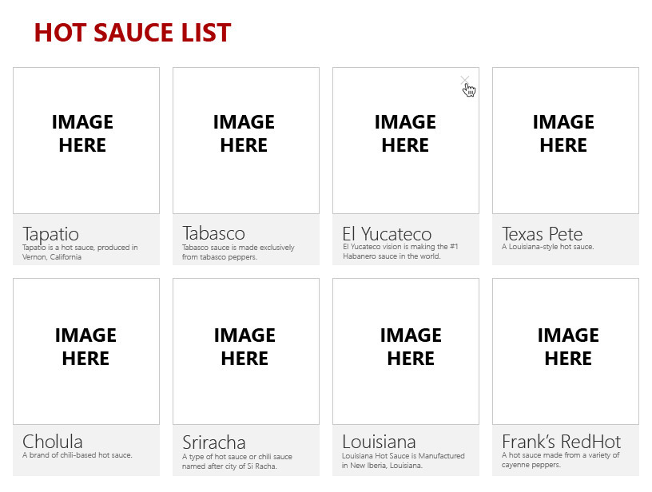
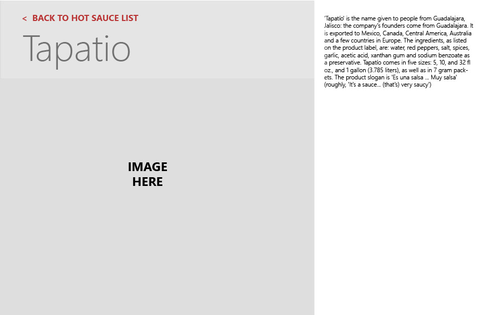

# Hot Sauce Project Challenge 🌶 🔥 🥵

## Project Overview
This is a code challenge geared toward design and user experience. Given the image templates as a reference, the challenge is to create a site that every user would enjoy! Using React.js as the frontend framework, other tools are optional for any needed enhancements. 

## Personal Notes:
I have personally manipulated the stock json file by adding a spicy rating to the existing objects. By thinking, if I was a user and I was looking at a list of hot sauce's what else would I like to see? Spicy levels for the hot sauce was a must! I have used affinity designer to create little peppers and half peppers to indicate their spicy rating. For additional UX design implementations were using some react-material-bootstrap for card design layout and react-rewards. React-rewards can be seen when a user successfully adds a new hot sauce. 

## Project Objectives: 🗒
1. Landing page will display all hot sauce's in json file. 
2. User will have the option to delete any item in the list. 
3. If any item is clicked, user will be taken to single product page with chosen product displayed. All
details should be available to view. 
4. From the landing page, user should contain a add to sauce list link. 
5. The add sauce page will contain a form with all the necessary inputs to add a new sauce to existing list. 

## Project Functionality 👷🏻
1. App.js will initialize json file to localStorage
2. Landing page actions: delete item, render items from localStorage, send data to Cards.js all items from the list as props.
3. Add product page: takes all values for adding new item to existing sauce list and saves new item to localStorage
4. Single product page: gets url params (product name) and filters from product list matching product name, displays single product returned. 

### Screen shots of stock templates: 📸
</img>
</img>

## Run Project Locally 💻
#### Steps to install repo: 
1. from the main page of github repository, click the clipboard to copy repo's url.  
2. From your terminal, in your local computer, pick a location where you would like the project to be saved. 
3. Enter the command in your terminal: *git clone* (copied url)
4. Press: *enter*

**Once the repo is finished installing...**

5. Enter the command in your terminal: *npm i*
6. Press: *enter*

**npm i - install's all the project dependencies needed to run the application.** 

**After dependencies are finished installing...** 
- Now its time to start the application
7. From your terminal type: *npm start*
8. Press: *enter*

###### 🎉 Congrats! Hot Sauce app will run on localhost in the browser. 🎉

This project was bootstrapped with [Create React App](https://github.com/facebook/create-react-app).
Runs the app in the development mode.\
Open [http://localhost:3000](http://localhost:3000) to view it in the browser.

